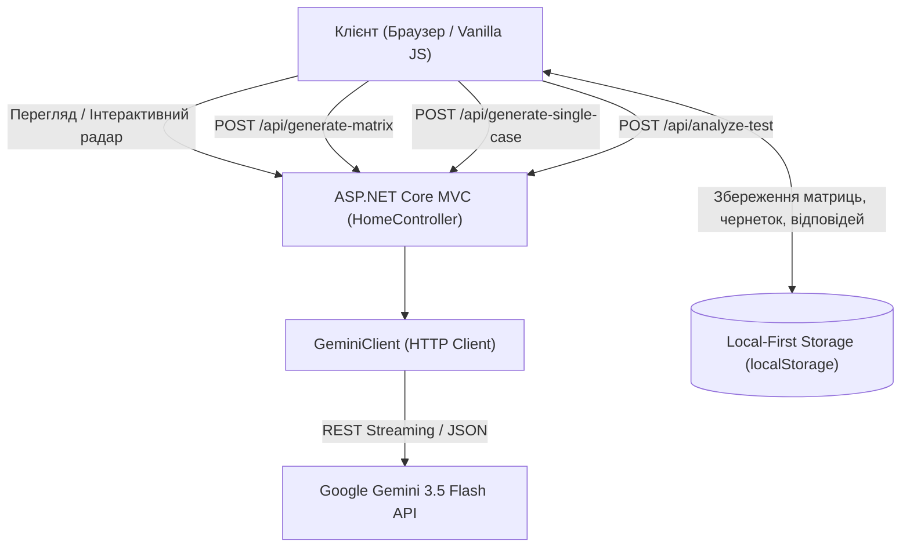

# 🧠 SmartTest — AI-Powered Multidimensional Assessment Platform

<div align="center">

[](https://dotnet.microsoft.com/)
[](https://dotnet.microsoft.com/apps/aspnet)
[](https://ai.google.dev/)
[](https://docs.microsoft.com/en-us/dotnet/csharp/)
[](https://github.com/)

**Інтелектуальна платформа нелінійного психометричного профілювання та генерації ситуаційних дилем на базі Google Gemini AI.**

[✨ Демонстрація фіч](#-ключові-можливості) • [🏗️ Архітектура](#️-архітектура-та-технологічний-стек) • [🚀 Швидкий старт](#-швидкий-старт) • [🎯 Сценарій тестування](#-сценарій-тестування)

</div>

---

## 📌 Про проект

Традиційні HR-тести та опитувальники мають серйозні вади:
- ❌ **Очевидні «правильні» відповіді** — респонденти обирають соціально очікувані варіанти.
- ❌ **Одновимірні лінійні бали** — не відображають комплексності реального мислення.
- ❌ **Складність створення** — розробка психометричної матриці вручну вимагає тижнів роботи експертів.

**SmartTest** вирішує це завдяки поєднанню **багатовимірних векторних дилем** та **генеративного штучного інтелекту Google Gemini**:
- Кожна відповідь — це зріла, практична стратегія дій в умовах невизначеності.
- Кожен вибір змінює координати людини у багатовимірному просторі компетенцій.
- Конструктор дозволяє створити авторську матрицю тестування на будь-яку тему **за 5 секунд**.

---

## ✨ Ключові можливості

### 1. ⚡ ШІ-Конструктор матриць тестування (`/create`)
- **Live AI Synthesis**: введення будь-якої професійної теми (наприклад, *«Кризовий менеджмент у стартапах»*) генерує:
  - 5 збалансованих осей компетенцій для спайдер-діаграми.
  - Повні ситуаційні кейси без очевидно правильних чи токсичних варіантів.
  - Автоматичний розрахунок векторних балів (`+10` ... `+100`) та мікро-архетипів.
- **Повна інтерактивність векторів**: можливість налаштовувати, на які саме осі впливає кожна дія, змінювати бали, додавати нові вектори або видаляти їх.
- **Динамічна кількість відповідей (2–6)**: кейси не обмежені чотирма варіантами. Користувач може легко додавати або видаляти альтернативи з автоматичною переіндексацією (`A, B, C...`).
- **Синхронізація осей на льоту**: додавання чи видалення осі миттєво оновлює всі випадаючі списки у всіх кейсах.
- **Керування чернетками**: швидке автозбереження у локальні чернетки (`/drafts`) з можливістю відновлення в один клік.

### 2. 🎯 Інтерактивний тест із "Живим радаром" (`/question`)
- **Real-Time SVG Radar**: інтерактивна спайдер-діаграма в реальному часі деформується та візуалізує зміну фокусу скілів при кожному кліку на варіант відповіді.
- **Підтримка авторських матриць**: створені користувачем тести можна одразу протестувати наживо (`/question?matrix=custom`).
- **Динамічний розрахунок точності**: статистична оцінка внутрішньої узгодженості виборів та дисперсії формує персоналізовану точність вердикту (**92.0% – 99.4%**) замість статичних шаблонів.

### 3. 📊 Глибокий персоніфікований вердикт (`/result`)
- **Домінантний архетип**: визначення ключового стилю мислення (наприклад, *«Стратегічний Архітектор»*, *«Емпатичний Ментор»*, *«Кризовий Лідер»*).
- **Суперсили та Зони росту**: практичні висновки та поради від нейромережі.
- **Матриця командної синергії**:
  - 🤝 *Ідеальний партнер у команді* — хто найкраще доповнює.
  - 💡 *Творчий союз* — синергія в генеруванні ідей.
  - ⚡ *Зона тертя* — де можливий конфлікт та як його нівелювати.
- **Рекомендовані ролі**: релевантні позиції для респондента.

---

## 🏗️ Архітектура та технологічний стек



| Компонент | Технологія | Призначення |
| :--- | :--- | :--- |
| **Backend** | `.NET 10` / `C#` | Високопродуктивне ядро, контролери, маршрутизація |
| **Web Framework** | `ASP.NET Core MVC` | Razor Views (`.cshtml`), бекенд-ендпоінти API |
| **AI Engine** | `Google Gemini API` | Генерація дилем, розрахунок ваг, психометричний аналіз |
| **Client UI** | `HTML5`, `CSS3`, `Vanilla JS` | Без важких залежностей, сучасний дизайн, адаптивність |
| **Візуалізація** | `Динамічний SVG` | Жива спайдер-діаграма з реактивною анімацією координат |
| **Сховище** | `Local-First (localStorage)` | Миттєве збереження без затримок мережі, конфіденційність |

---

## 🚀 Швидкий старт

### 1. Вимоги
- [.NET 10 SDK](https://dotnet.microsoft.com/download/dotnet/10.0)
- Ключ доступу до [Google Gemini API](https://aistudio.google.com/)

### 2. Клонування репозиторію
```bash
git clone https://github.com/0Valeriy0/cacatone_2026.git
cd cacatone_2026/cacatone_2026
```

### 3. Налаштування API-ключа
Відкрийте `appsettings.json` (або `appsettings.Development.json`) та вкажіть ваш ключ Gemini API:
```json
{
  "Gemini": {
    "ApiKey": "ВАШ_GEMINI_API_KEY",
    "Model": "gemini-2.5-flash"
  }
}
```

### 4. Запуск проекту
```bash
dotnet build
dotnet run
```
Після запуску відкрийте у браузері:
👉 **`http://localhost:5000`** (або порт, вказаний у консолі).

---

## 🧭 Структура проекту

```
cacatone_2026/
├── cacatone_2026/                  # Основний Web-проект ASP.NET Core
│   ├── AiClients/
│   │   └── GeminiClient.cs         # Клієнт взаємодії з Gemini API (генерація та аналіз)
│   ├── Controllers/
│   │   └── HomeController.cs       # Маршрутизація сторінок та API-ендпоінти
│   ├── Views/Home/
│   │   ├── Index.cshtml            # Головна сторінка та вітрина можливостей
│   │   ├── Create.cshtml           # Інтерактивний ШІ-конструктор матриць
│   │   ├── Question.cshtml         # Проходження тесту з живим SVG-радаром
│   │   ├── Result.cshtml           # Персоналізований AI-вердикт та командна синергія
│   │   ├── Drafts.cshtml           # Менеджер збережених чернеток
│   │   ├── All.cshtml              # Каталог доступних матриць оцінювання
│   │   ├── Published.cshtml        # Спільнота опублікованих авторських тестів
│   │   └── Login.cshtml            # Авторизація та профіль користувача
│   ├── wwwroot/                    # Статичні ресурси (стилі, іконки, скрипти)
│   ├── appsettings.json            # Конфігурація додатка та API-ключів
│   └── Program.cs                  # Точка входу, DI-контейнер та пайплайн
└── README.md                       # Документація проекту
```

---

## 🎯 Сценарій демонстрації (Demo Workflow)

1. **Головна (`/`)**: ознайомлення з концепцією нелінійного профілювання.
2. **Конструктор (`/create`)**:
   - Натисніть **«⚡ Автозаповнення ШІ»** для автоматичного створення 5 осей та кейсів.
   - Спробуйте змінити вагові коефіцієнти, вісь впливу або додати варіант кнопкою **«+ Додати варіант відповіді»**.
   - Натисніть **«Опублікувати та відкрити тест»**.
3. **Проходження тесту (`/question?matrix=custom`)**:
   - Обирайте різні поведінкові стратегії.
   - Спостерігайте за реактивною зміною **Радара скілів** у реальному часі.
4. **Результати (`/result`)**:
   - Отримайте глибокий звіт: персоналізовану точність вердикту, рекомендовані ролі та карту командної синергії.

---

## 👥 Команда розробки (Kakaton 2026)

- **Розробка та архітектура**: Команда *Team Vitalichi*
- **Створено спеціально для**: Студентського какатону 2026

<div align="center">
  <sub>Зроблено з любов'ю до інженерії та штучного інтелекту 🚀</sub>
</div>
